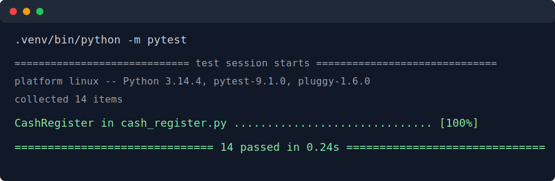

# Cash Register Lab

## Description

This project models a basic cash register with object-oriented Python. The
`CashRegister` class can add items, track item quantities, apply percentage
discounts, and void the most recent transaction.

## Features

- Initialize a register with an optional discount percentage.
- Validate discounts so they are integers from 0 through 100.
- Track the running `total`.
- Store each purchased item in `items`, including repeated entries for quantity.
- Store sale history in `previous_transactions`.
- Apply a percentage discount to the current total.
- Void the most recent transaction and update the total and item list.

## Project Structure

```text
lib/
  cash_register.py
  testing/
    cash_register_test.py
```

## Installation

This is a Python project. The dependency list is kept in `Pipfile`.

```bash
python3 -m venv .venv
.venv/bin/python -m pip install --upgrade pip pytest
```

The original lab text mentions `npm install`, but this repository does not
include a `package.json`, so there are no Node dependencies to install.

## Usage

```python
from cash_register import CashRegister

register = CashRegister(20)
register.add_item("macbook air", 1000)
register.apply_discount()

print(register.total)
print(register.items)
```

## Testing

Run the automated test suite with:

```bash
.venv/bin/python -m pytest
```

Latest local result:



## Source

This solution is for the Object Oriented Programming Part 2 Cash Register lab.
